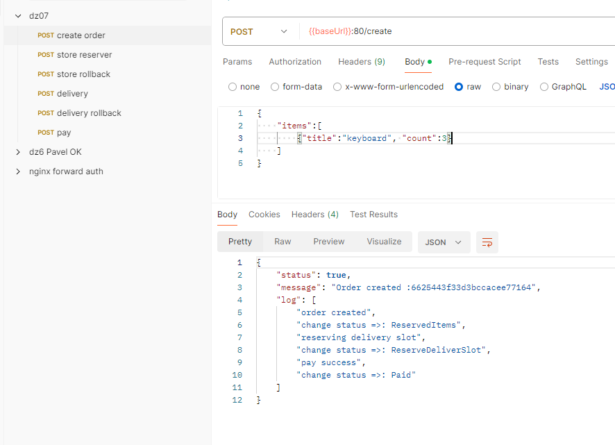
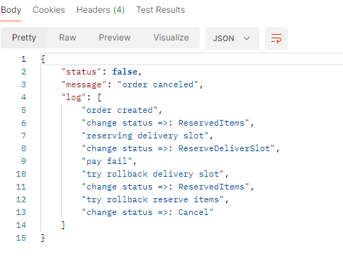

# 07dz

### Сервис заказов с saga

Запрос /create создает заказ, с товарами и количеством в статусе new.

Резервирует товар, в сервисе Store, если товара хватает(на складе 3 наименования monitor, keyboard, mouse по 30 штук) и
такой товар есть( возвращает 200). Если не хватает, возвращает 200, но в json ответе Status:false. Если что-то
случилось, возвращает 500.
Если возникнет ошибка или не хватит товаров, то запустится rollback

Резервирует временной слот доставки в сервисе Delivery, всего слотов 11(т.е. условно с 10 утра до 20ти часов). Если
слоты закончатся, сервис сообщит об этом.
Если возникнет ошибка или не хватит слотов, то запустится rollback

Оплачивает заказ в сервис Pay. Он всегда возвращает 200.
Если достучатся, до сервиса не вышло, то запуститься rollback

### Rollback

Функция откатки заказа, из любого статуса, то достояния cancel.
Например, если pay, не прошел. То `Rollback` вызовет Rollback сервиса delivery(т.е. освободит слот), и вызовет Rollback
сервиса Store(снимет товары с резерва)

### Тестирование

- клонировать репозиторий
- перейти в каталог 07_saga
- создать namespace `kubectl create ns 07dz`
- выполнить `make i` это запустить helm (после тестов, удалить инсталляцию `make ui`)

Для удобства, в ответе на запрос /create, будет краткий log похода в другие сервисы, и вызовы rollback

Запрос:
`{
"items":[
{"title":"keyboard", "count":3}
]
}`

Ответ:

### Случай когда сервис Pay отключен командой  `kubectl delete svc pay -n 07dz` откатится резерв товара и временного слота доставки 

### ps 
Данные каждого сервис хранятся в своих БД, т.е. сервисы можно перезапускать.

