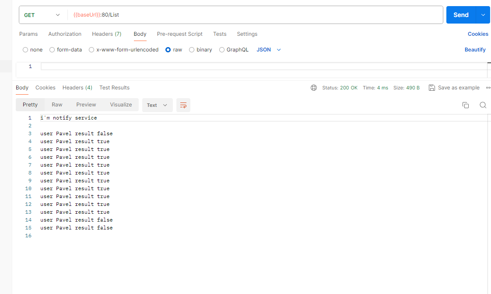

# 08dz

## Сервис заказов на брокере

В наружу смотрят все 3 сервиса, между собой общаются через брокер NATS

### Сервис Billing (stateful):

Тут создаются пользователи, пополняется баланс, и списывается с баланса. Сервис ожидает поступление заказов в брокер,
при получении проверяет, если такой пользователь, хватает ли средств. Если
хвататет скидывает положительный результат брокер, если не хватает, то скидывает отрицательный.

Создать пользователя POST `/CreateUser`
`{
"user":"Pavel",
}`

Положить на баланс POST `/DepositCash`
`{
"user":"Pavel",
"sum":100
}`

### Сервис Order (stateless):

Тут создаются заказы, ничего не проверяется, т.к. сервис не знает о пользователях и их балансе. Просто создает заказ, и
скидывает в
очередь

Создать заказ POST `/Order`
`{
"user":"Pavel",
"sum":10
}`

### Сервис Notify (stateful):

Читает брокер, что бы условно отправить уведомление пользователю, и бонусом показывает что в БД(т.е. результат
положительный\отрицательный)

Посмотреть лог GET `/List`
`{
"user":"Pavel",
"sum":10
}`

## IDL

Запросы, сервисы, сообщения брокера описаны в `schema/*.proto`

## Sequence diagram

## Тестирование

- клонировать репозиторий
- перейти в каталог 08_stream_processing
- создать namespace `kubectl create ns 08dz`
- выполнить `make i` это запустит helm (после тестов, удалить инсталляцию `make ui`)
- Импортировать коллекцию запросов `dz08.postman_collection.json` в постман
- выполнить запросы, `CreateUser`, `DepositCash`, `CreateOrder` (этот несколько раз, или изменить сумму заказа, что бы
  получилось что денег на оплату не хватает), `List notify`

### Результат:

