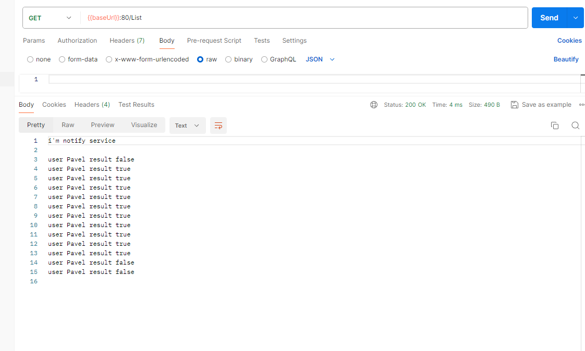

# 08dz

## Сервис заказов на брокере с идемпотентностью

Основная информация описана в предыдущей работе, тут описано только введение идемпотентности.

Теперь что бы отправить заказ на оформление, его нужно отправлять с id корзины, который нужно получить заранее запрос `GetBasket`.
Сервис `billing` теперь пишет к пользователю: историю оплаченных корзин, так он понимает, обработали эту корзину или нет. А т.к. бд монга, операции с документов атомарные. Если ack упадет, то когда сообщение придет еще раз, сервис поймет, обрабатывал ли этот заказ, и если да, то просто ответит ack.         

### Сервис Order:

Сервис меняет статус корзины по паттерну compare-and-set

Получаем id корзины GET `/GetBasket` пока корзина не оплачена, всегда будет возвращаться один и тот же id
`{
"user":"Pavel"
}`

ответ
`{
"status": true,
"message": "662bd9a77c3d4e091e514e0f"
}
`

Создать заказ, теперь с basketId POST `/Order`
`{
"user":"Pavel",
"sum":10,
"basket":"662bd9a77c3d4e091e514e0f"
}`

### Сервис Billing:

Создать пользователя POST `/CreateUser`
`{
"user":"Pavel",
}`

Положить на баланс POST `/DepositCash` (тут изменений не делал, т.к. аналогично с getBasket)
`{
"user":"Pavel",
"sum":100
}`

### Сервис Notify:

Читает брокер, что бы условно отправить уведомление пользователю, и бонусом показывает что в БД(т.е. результат
положительный\отрицательный)

Посмотреть лог GET `/List`
`{
"user":"Pavel",
"sum":10
}`

## IDL

Запросы, сервисы, сообщения брокера описаны в `schema/*.proto`

## Sequence diagram

## Тестирование

- клонировать репозиторий
- перейти в каталог 09_idempotent
- создать namespace `kubectl create ns 09dz`
- выполнить `make i` это запустит helm (после тестов, удалить инсталляцию `make ui`)
- Импортировать коллекцию запросов `dz09.postman_collection.json` в постман
- выполнить запросы, `CreateUser`, `DepositCash`, `CreateOrder` (этот несколько раз, или изменить сумму заказа, что бы
  получилось что денег на оплату не хватает), `List notify`

### Результат:

