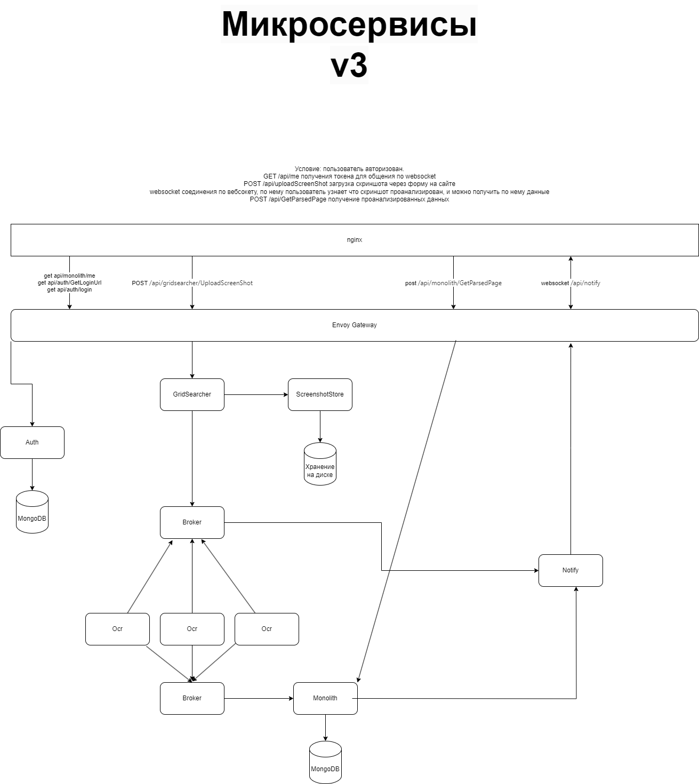

# Итоговый проект по курсу Otus MSA

### Преамбула
Существует экшен игра Escape from tarkov.
В игре кроме стрельбы по виртуальный противникам, есть механики квестов, постройки убежища, барахолки.
Механики\термины
Рейд: основная механика игры, персонаж выходит на карту с другими игроками и ботами. Во время рейда убиваются виртуальные противники, ищутся предметы, выносятся предметы на склад игрока.
Квесты(задачи): выдаются последовательно. В некоторых квестах, задача найти на карте игры какие предметы, и сдать их NPCу.
Убежище: строительство станций, из предметов которые ищутся на карте в Рейде.
Барахолка: рынок, на котором можно выставить на продажу найденные в рейде предметы, и купить предметы выставленные другими игроками.

### Цели выдуманного сервиса https://tarkovloot.dev.
Помочь игроку понять какие предметы ему нужны сейчас и в будущем для квестов, постройки убежища и выгодной продажи на барахолке.
Пользователь может сделать скриншот в игре, передать его в сервис tarkovloot, и сервис покажет нужен ли предмет игроку.
Дополнительная возможность, общая оценка вынесенного из рейда предметов, для демонстрации другим игрокам и примерно оценки успешности рейда.

### Презентация https://docs.google.com/presentation/d/1fy9__Kw9PahANMocBjenzeFSP94IhZYetfBkDpPE3A8/edit?usp=sharing
### Кликабельная с4 в каталоге "c4"
### Базовая схема взаимодействия микросервисов

### Sequence diagram
![Sequence diagram](https://www.plantuml.com/plantuml/svg/hLNDRlf64B_xAUROIY2a_n5LVoLDAvgg3IWGvUp0Xg0Od1fJDJSWpKT5LDggXvxx1CG5GI0ahx3xHltDc3WRMxIgr4J2ykpi_3vcPxtJ3TqWxBKznws7Va2x_EiuZZpp7tTxuHaLwQjQhL8eVLaZzw9LS14hVECtMvsI2ey2ZpxHSptHBwQldys0p03_8xtIIpqXFTKhCoOiHsQ8vRvUSBAvmND1EgAcxpSzHJuN_VGLjIJ1CeD_iC3r7oWtqsjKMfWVKM4PLp9Zc-vcGwLShL4XuUinNzA_P7dmRcIaKBUaVeXpWSI0HUggC5_t_VEMeg-FQubjt_eTtsinbuIyK6blueMseiIqYRa3H8ItcNuYnjHBbfcO1z5c8F4NlSRlN_gPaBB2hjYDYTDmG_V4xIewwghWYy-Tc02hYWFGysTIbmMH_bN_lacp1UdVa3RNaV3wASCfwL3GQdIL6zJFL60PNXILJMknS7JX-MwZMW-KwbJF_12MTHfqslAKutpNKpr5Y0PXJVqGxhURZbtOzh5vMDahxWNA3TL-vtlL0OlBYjjK1xqsvGZ6FCEhAtCRCvQ0wPinl5jYASA1V2GnxmbczedzP8a8BSoD6RqPM4LbzSx1JQI8JUBDDCP8rxX20BWWmV4H9_IHDpTNO7RFNH8RdvoKnWC_R9rU5gji2qWFupEX8-wzu0ZjA7NaVywHkUM2XF14F-gLRG8wbUDz4p5aXUV0t1EM7wJsW-2Wb1E3lxN_M9rq_Vgv2b-htKCmq8NyZDzJNfiXGM24jQcOks9iFfXfcNQNnSebyz9JCqgEFdYjvA0jSYanUesqcJH0jl9G8dOdEYQa8sZZJ75yoYIXdSfxXuuDc_zOhaCZmbm4oUBg89ULP3DXn_XEawGv5vOKyMF9lMPuEGFNwGDTSOEkQZX05VrsC6i1LnKm6ogHhgVsIqQlaoflZuwjxh-0y2rXmqXR5iG3XRqB56BDSNcvwzUR5i4zR07W4FQCmPRTtZPGvZgU8JEskFqhkwHQCZzoGnIsJj6MKveUelIC073BZFmF8vBzMk13yVuxKLARXl9Tjnqm-oqHsEm554D-bi__y_58xuh_Tc1kh-tz3G00)

### Тестовые скрины в каталоге test, можно прогнать на https://tarkovloot.dev